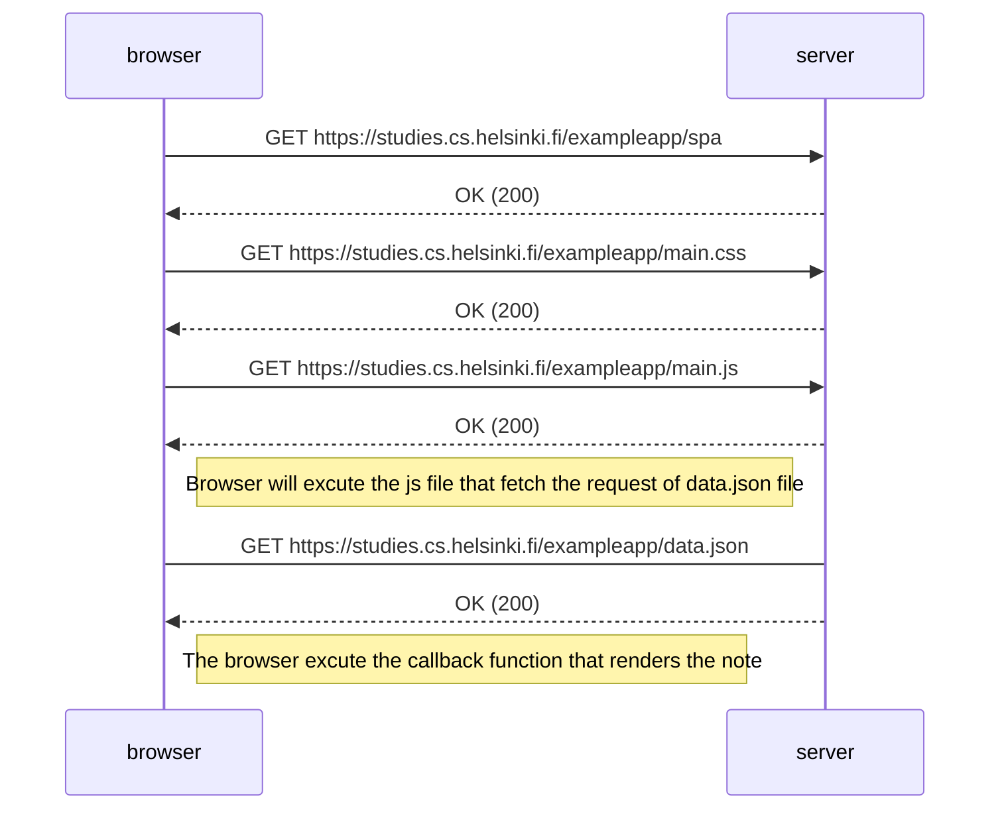

# Exercise 0.5

```mermaid
sequenceDiagram
    participant browser
    participant server
    browser->>server: GET https://studies.cs.helsinki.fi/exampleapp/spa
    server-->>browser: OK (200)
    browser->>server: GET https://studies.cs.helsinki.fi/exampleapp/main.css
    server-->>browser: OK (200)
    browser->>server: GET https://studies.cs.helsinki.fi/exampleapp/main.js
    server-->>browser: OK (200)
    Note right of browser: Browser will excute the js file that fetch the request of data.json file
    browser->server: GET https://studies.cs.helsinki.fi/exampleapp/data.json
    server-->>browser: OK (200)
    Note right of browser: The browser excute the callback function that renders the note
```
